# UniMove — Manuale Utente
**Applicazione di Carpooling per la Community Universitaria (UniMol)**

Benvenuto in **UniMove**, l'applicazione di carpooling progettata appositamente per studenti, docenti e personale dell'Università degli Studi del Molise (UniMol). UniMove ti consente di condividere i tuoi viaggi in auto verso le sedi dell'ateneo o di trovare passaggi offerti da colleghi universitari, riducendo i costi di trasporto e l'impatto ambientale.

Questa guida illustra nel dettaglio tutte le sezioni e le funzionalità dell'applicazione.

---

## Indice
1. [Accesso e Registrazione (Login)](#1-accesso-e-registrazione-login)
2. [Benvenuto e Tratte Preferite](#2-benvenuto-e-tratte-preferite)
3. [Home — I Miei Eventi (Corse Create)](#3-home-i-miei-eventi-corse-create)
4. [Home — Prenotazioni (Corse Prenotate)](#4-home-prenotazioni-corse-prenotate)
5. [Home — Archivio (Corse Completate)](#5-home-archivio-corse-completate)
6. [Creazione di una Corsa (Offri un passaggio)](#6-creazione-di-una-corsa-offri-un-passaggio)
7. [Ricerca di una Corsa](#7-ricerca-di-una-corsa)
8. [Profilo Utente e Recensioni](#8-profilo-utente-e-recensioni)
9. [Impostazioni](#9-impostazioni)
10. [Preferenze Profilo (Preferenze di viaggio)](#10-preferenze-profilo-preferenze-di-viaggio)
11. [Informazioni Bancarie (Donazioni Volontarie)](#11-informazioni-bancarie-donazioni-volontarie)
12. [Preferenze Tratte](#12-preferenze-tratte)

---

## 1. Accesso e Registrazione (Login)

La schermata di accesso è il punto d'ingresso di UniMove. Per accedere al servizio, inserisci le credenziali fornite dall'ateneo.

*   **Username**: Inserisci il tuo nome utente istituzionale (formato suggerito: `n.cognome`).
*   **Password**: Digita la tua password riservata. Puoi cliccare sull'icona dell'occhio per mostrare o nascondere i caratteri digitati.
*   **Condizioni d'Uso e Privacy**: Spunta obbligatoriamente la casella per accettare le condizioni di utilizzo e l'informativa sulla privacy prima di procedere.
*   **Accedi**: Premi il pulsante verde in basso per entrare nell'applicazione.

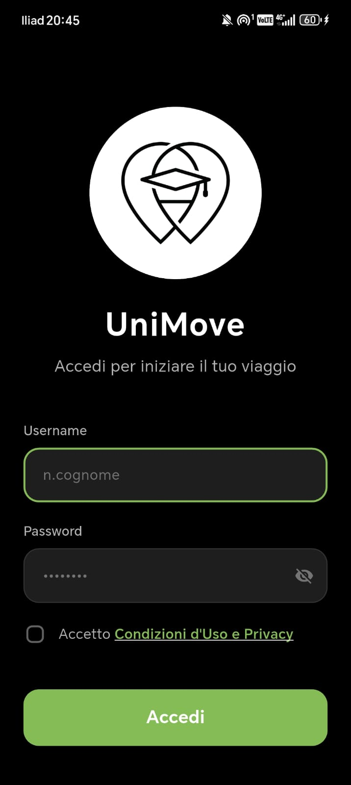

---

## 2. Benvenuto e Tratte Preferite

Al primo accesso, verrai accolto da una schermata di benvenuto che ti invita a impostare le tue tratte preferite. Questo consente a UniMove di mostrarti subito i passaggi più rilevanti per te e di inviarti notifiche mirate.

*   **Configurazione**:
    1. Inserisci il **Comune di partenza**.
    2. Inserisci il **Comune di arrivo**.
    3. Clicca su **+ Aggiungi tratta**. Puoi registrare fino a un massimo di **3 tratte preferite**.
*   **Conferma**: Premi il pulsante verde **Conferma** per salvare e procedere alla Home.
*   **Salta**: Se preferisci configurare le tratte in un secondo momento, puoi cliccare su **Salta per ora** in fondo alla schermata.

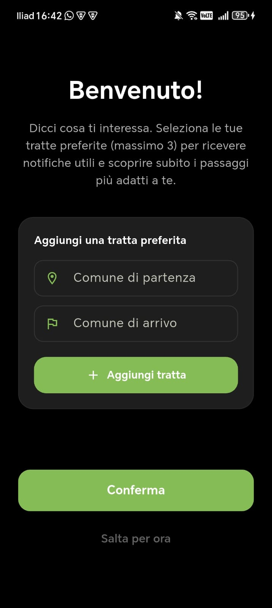

---

## 3. Home — I Miei Eventi (Corse Create)

La Home dell'applicazione è organizzata in tre schede principali a scorrimento orizzontale. La prima scheda è **I miei eventi**.

*   Qui vengono mostrate tutte le corse che hai **creato e offerto** come conducente.
*   Se non hai ancora pianificato o creato alcun viaggio, visualizzerai la schermata di stato vuoto con il messaggio *"Inizia il tuo viaggio! Non hai ancora corse attive"*.
*   Da questa schermata, puoi monitorare l'andamento dei passeggeri che si prenotano per le tue corse.

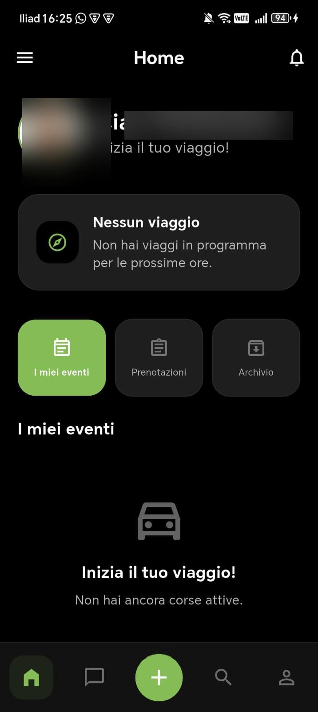

---

## 4. Home — Prenotazioni (Corse Prenotate)

La seconda scheda della Home è **Prenotazioni**.

*   Qui troverai tutte le corse alle quali ti sei **prenotato come passeggero**.
*   Ogni corsa prenotata è rappresentata da una scheda riepilogativa che mostra:
    *   **Data del viaggio** (esposta nel riquadro nero laterale).
    *   **Stato**: Contrassegnato dal badge verde `Prenotata`.
    *   **Orario e Luogo di Partenza**: Compreso il punto di incontro specifico concordato.
    *   **Orario e Luogo di Arrivo**.
    *   **Dettagli Conducente**: Nome e cognome dell'utente che offre il passaggio.
*   **Annullamento**: Se non puoi più partecipare al viaggio, puoi annullare la prenotazione in qualsiasi momento cliccando sul pulsante **Cancella** all'interno della scheda.

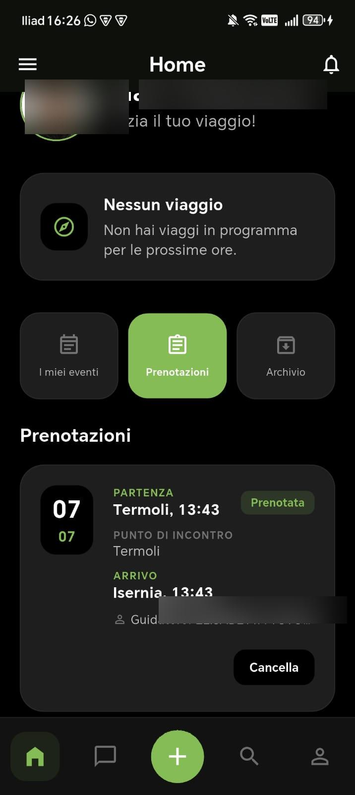

---

## 5. Home — Archivio (Corse Completate)

La terza scheda della Home è **Archivio**.

*   Qui sono elencate tutte le **corse passate e completate**, sia quelle che hai offerto come conducente (contrassegnate dal badge verde `Conducente`), sia quelle a cui hai partecipato come passeggero.
*   La scheda riassume la data, gli orari, le località di partenza e arrivo e le eventuali fermate intermedie effettuate.
*   Questa sezione è utile per tenere traccia dello storico dei tuoi spostamenti.

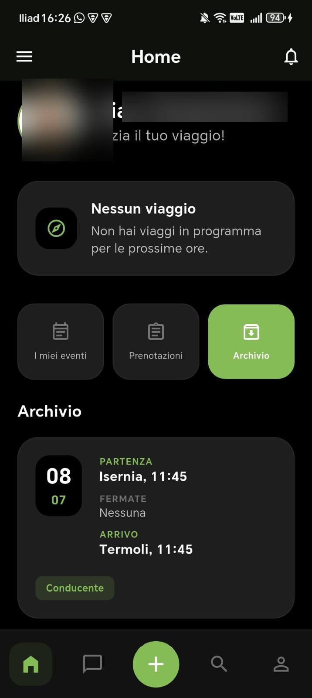

---

## 6. Creazione di una Corsa (Offri un passaggio)

Se possiedi un'auto e vuoi offrire un passaggio ai colleghi universitari, puoi creare una nuova corsa premendo il grande pulsante verde **"+"** posizionato al centro della barra di navigazione inferiore.

La creazione si articola nei seguenti campi:

### Percorso & Orari
*   **Città di partenza (*)**: Inserisci il comune da cui intendi partire.
*   **Città di arrivo (*)**: Specifica il comune di destinazione (ad esempio la sede del tuo dipartimento UniMol).
*   **Data e Ora di partenza (*)**: Indica quando partirà il viaggio.
*   **Data e Ora di arrivo stimata (*)**: Specifica l'orario previsto per l'arrivo a destinazione.

### Veicolo & Posti
*   **Posti disponibili (*)**: Scegli dal menu a tendina quanti posti liberi hai a disposizione nella tua auto (es. `4 posti`).
*   **Modello auto (Opzionale)**: Inserisci facoltativamente il modello e colore del tuo veicolo per farti riconoscere più facilmente dai passeggeri.

| Schermata 1: Dettagli Percorso | Schermata 2: Fermate e Preferenze |
| :---: | :---: |
| 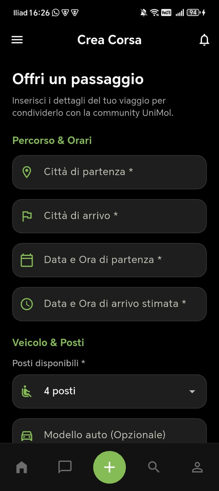 | 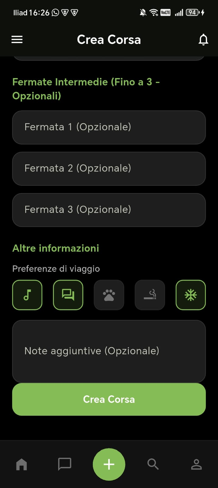 |

### Fermate Intermedie
*   Puoi aggiungere fino a **3 fermate intermedie opzionali** lungo il percorso per consentire a passeggeri residenti in comuni limitrofi di salire a bordo.

### Altre Informazioni
*   **Preferenze di viaggio**: Seleziona le icone relative alle tue preferenze per questo specifico viaggio:
    *    **Musica a bordo**: Indica se ti fa piacere ascoltare musica.
    *    **Conversazione**: Indica se sei aperto a fare quattro chiacchiere.
    *    **Animali ammessi**: Specifica se accetti animali domestici.
    *    **Vietato fumare**: Specifica se è consentito o meno fumare a bordo.
    *    **Aria condizionata**: Indica se è disponibile l'aria condizionata.
*   **Note aggiuntive**: Un campo di testo libero dove inserire dettagli utili (es. *"Attendo massimo 5 minuti al punto di incontro"* o indicazioni sul bagaglio).

Una volta compilati tutti i campi obbligatori, clicca sul pulsante verde **Crea Corsa** in fondo alla pagina per pubblicare il viaggio.

---

## 7. Ricerca di una Corsa

Per cercare un passaggio come passeggero, clicca sull'icona della lente d'ingrandimento nella barra di navigazione in basso.

Puoi inserire i seguenti criteri per filtrare le corse attive:
*   **Username guidatore** (opzionale): Per cercare i passaggi offerti da un utente specifico.
*   **Data di partenza (*)**: Campo obbligatorio per visualizzare i viaggi pianificati in una determinata giornata.
*   **Città di partenza**: Filtra le corse che partono dalla tua città.
*   **Orario di partenza**: Specifica la fascia oraria di tuo interesse.
*   **Città di arrivo**: Filtra per la destinazione desiderata.
*   **Orario stimato di arrivo**: Specifica l'orario entro cui hai necessità di arrivare.
*   **Posti necessari (*)**: Scegli dal menu a tendina il numero di posti che desideri prenotare (es. `1 posto`).

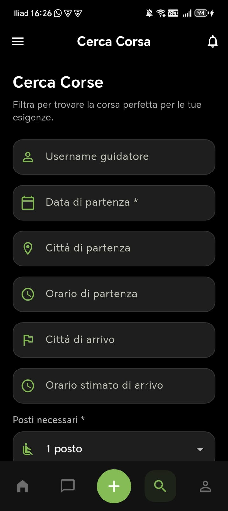

---

## 8. Profilo Utente e Recensioni

Cliccando sull'icona dell'omino a destra nella barra inferiore, accedi al tuo **Profilo**.

La pagina del profilo mostra una panoramica pubblica visibile agli altri utenti:
*   **Foto e Dettagli**: Il tuo nome, cognome e il tuo ruolo all'interno dell'università (es. `studente`).
*   **Valutazione**: Mostra la media delle recensioni ricevute in stelle (da 1 a 5) e il numero totale di recensioni.
*   **Informazioni di contatto**: Il tuo indirizzo email universitario (es. `f.ferretti@studenti.unimol.it`).
*   **Preferenze di viaggio**: Una panoramica visiva delle icone relative alle tue preferenze personali attive.
*   **Recensioni ricevute**: L'elenco dettagliato delle recensioni lasciate dagli utenti che hanno viaggiato con te. Ciascuna recensione riporta il nome del recensore, la data, il voto in stelle (es. `5/5`) ed eventuali commenti scritti.

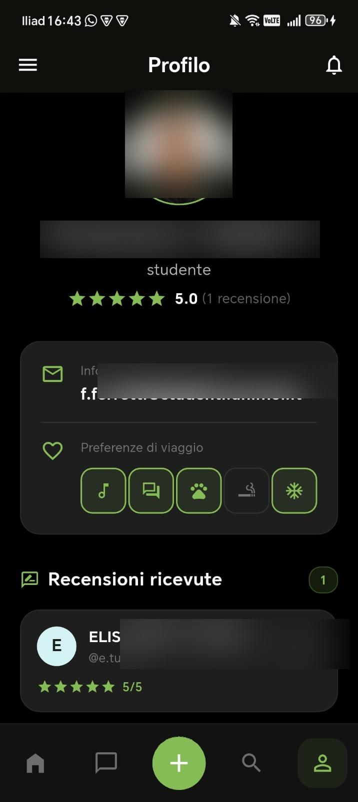

---

## 9. Impostazioni

Puoi accedere alla schermata **Impostazioni** cliccando sul pulsante del menu a tre linee (hamburger menu) posizionato in alto a sinistra nella schermata principale.

Il menu delle impostazioni ti dà accesso a tre opzioni di configurazione personali, oltre alla possibilità di disconnetterti:
1.  **Preferenze profilo**: Permette di modificare le preferenze relative al comfort di viaggio.
2.  **Informazioni bancarie**: Consente di registrare l'IBAN per la ricezione di contributi per le spese di viaggio.
3.  **Preferenze tratte**: Consente di modificare o aggiornare le tratte preferite.
4.  **Logout** (in rosso): Consente di uscire in modo sicuro dal proprio account.

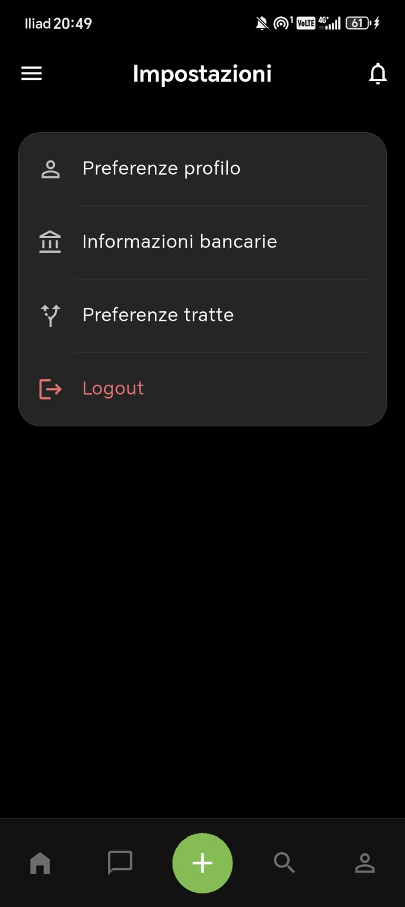

---

## 10. Preferenze Profilo (Preferenze di viaggio)

All'interno di questa schermata (accessibile da *Impostazioni -> Preferenze profilo*), puoi definire il tuo stile di viaggio predefinito. Queste opzioni verranno mostrate sul tuo profilo pubblico per aiutare gli altri utenti a conoscerti meglio.

Per ciascuna voce, puoi selezionare **Sì** o **No**:
*   **Musica a bordo**: Se ti piace ascoltare la radio o playlist musicali durante il tragitto.
*   **Chiacchiere / Conversazione**: Se preferisci chiacchierare per conoscersi o se prediligi il silenzio e la concentrazione.
*   **Animali domestici**: Se sei disposto ad accogliere o viaggiare con piccoli animali domestici.
*   **Fumo a bordo**: Se accetti che si possa fumare all'interno del veicolo.
*   **Aria condizionata**: Se preferisci che l'aria condizionata sia attiva durante le giornate calde.

Dopo aver effettuato le modifiche, premi **Salva modifiche** per renderle attive.

| Schermata 1: Preferenze superiori | Schermata 2: Preferenze inferiori e Salvataggio |
| :---: | :---: |
| 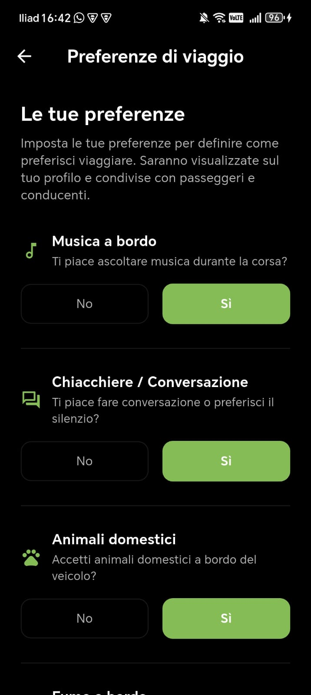 | 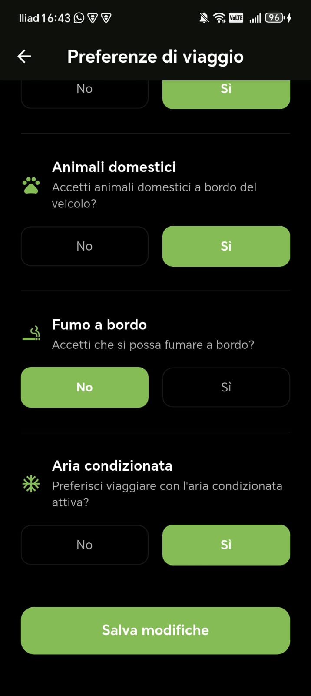 |

---

## 11. Informazioni Bancarie (Donazioni Volontarie)

UniMove incentiva la condivisione delle spese di viaggio sotto forma di donazioni e rimborsi spese volontari da parte dei passeggeri ai conducenti.

Per consentire ad altri utenti di inviarti donazioni tramite bonifico bancario, compila i seguenti dati in *Impostazioni -> Informazioni bancarie*:
*   **CODICE IBAN**: Inserisci il codice IBAN del tuo conto corrente bancario o della tua carta prepagata (es. formato italiano con inizio `IT...`).
*   **INTESTATARIO CONTO**: Specifica il Nome e Cognome del titolare del conto corrente associato all'IBAN.

Una volta inseriti i dati, premi **Salva modifiche**. I dati bancari verranno conservati in modo sicuro e mostrati esclusivamente ai passeggeri che viaggiano con te per facilitare il rimborso spese volontario.

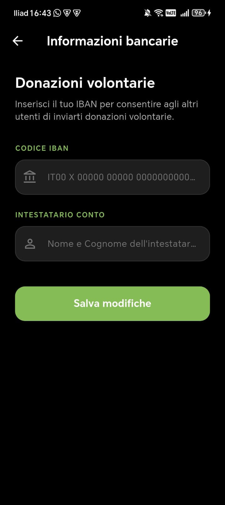

---

## 12. Preferenze Tratte

In questa sezione (accessibile da *Impostazioni -> Preferenze tratte*), puoi gestire l'elenco delle tue tratte preferite inserite durante la schermata di benvenuto o aggiungerne di nuove.

*   **Visualizzazione Tratte Attive**: In cima alla pagina vedi l'elenco delle tratte salvate (es. `Monteroduni -> Termoli`).
*   **Rimozione**: Cliccando sull'icona del cestino rosso accanto a una tratta, puoi rimuoverla immediatamente dall'elenco.
*   **Aggiunta Nuova Tratta**:
    *   Compila i campi **Comune di partenza** e **Comune di arrivo**.
    *   Clicca sul pulsante **Aggiungi tratta preferita** per salvarla (fino al limite massimo di 3 tratte contemporanee).

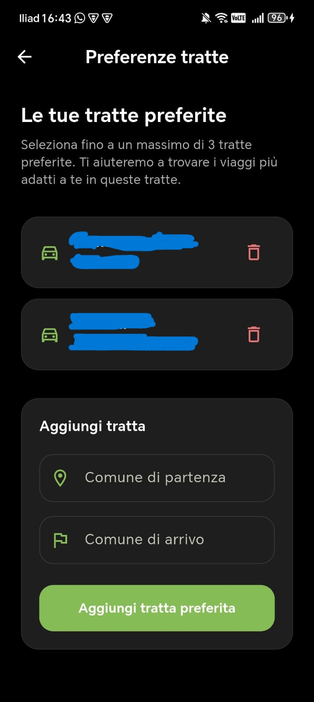
