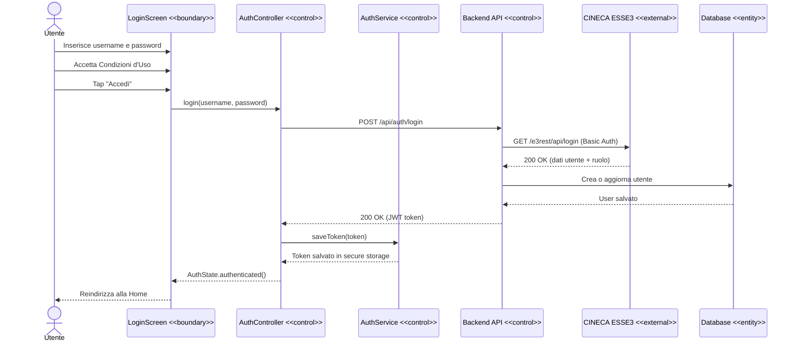
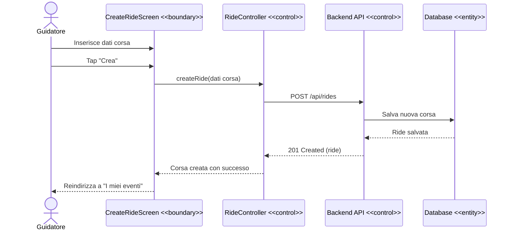
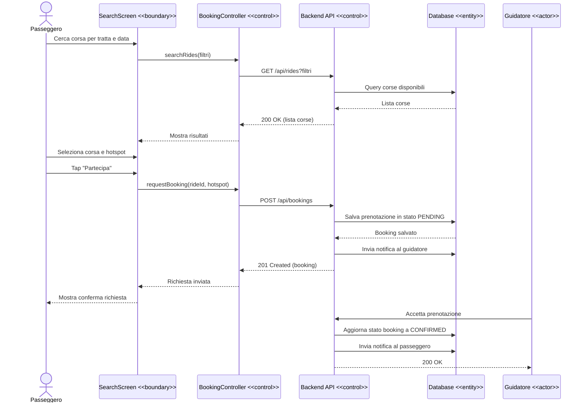
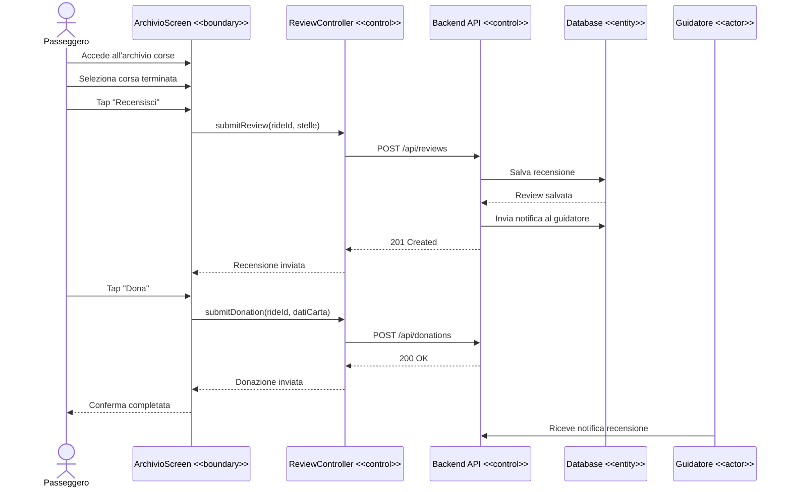

# 3.4 System Models

## 3.4.1 Scenarios

### Scenario 1) Login e primo accesso

Carmen è una studentessa di Ingegneria all'UNIMOL. Sente parlare di UniMove da un collega e decide di provare l'app. Apre l'applicazione per la prima volta, inserisce le proprie credenziali istituzionali dell'UNIMOL, quindi username e password di CINECA e accetta la Condizioni d'uso e la Privacy Policy. Il sistema verifica le credenziali tramite ESSE3 e la reindirizza alla schermata di benvenuto. Carmen imposta le sue due tratte preferite che vanno da Campobasso a Pesche e conferma. Da questo momento riceverà delle notifiche ogni volta che viene pubblicata una nuova corsa per quella tratta.

### Scenario 2) Creazione Corsa.

Andrea è un docente dell'UNIMOL che ogni lunedì mattina si sposta da Campobasso a Pesche per tenere le sue lezioni. Apre UniMove e decide di creare un evento di viaggio. Inserisce la data, la città di Partenza, due hotspot intermedi e la destinazione finale.Specifica il modello e la targa del suo veicolo e imposta il numero di posti disponibili. Essendo la prima volta che crea un evento, il sistema gli chiede di inserire facoltativamente le informazioni bancarie per ricevere eventualmente delle donazioni. Andrea decide di inserire il suo IBAN. La corsa viene pubblicata e resa visibile agli altri utenti dell'app.

### Scenario 3) Ricerca e prenotazione Corsa.

Marco è uno studente pendolare che abita a Camoobasso e deve raggiungere la sede di Pesche per un esame. Apre UniMove e accede alla schermata di ricerca. Inserisce come filtri la data, la città di partenza e di arrivo. Il Sistema restituisce un elenco delle corse disponibili. Marco visualizza i dettagli della corsa di Andrea(professore), composta da orari, hotspot disponibili, preferenze di viaggio e valutazione guidatore e decide infine di prenotarsi. Seleziona un hotspot intermedio di incontro e invia la richiesta di prenotazione. Andrea riceve una notifica con la richiesta di Marco e l'hotspot di incontro intermedio e la accetta. Marco riceve una notifica di conferma e può ora visualizzare la corsa nella sezione "Prenotazioni".

### Scenario 4) Gestione corsa in corso

Il giorno dell'evento, Andrea apre UniMove e avvia la corsa dalla schermata "I miei eventi". Il sistema aggiorna lo stato della corsa a "in corso". Marco, in attesa all'hotspot, apre l'app e dalla schermata "Prenotazioni" seleziona "Traccia" per visualizzare la posizione in tempo reale di Andrea sulla mappa. I due usano la chat privata per coordinarsi sul punto di incontro esatto. Andrea raggiunge l'hotspot, raccoglie Marco e prosegue verso Pesche. Una volta arrivati, Andrea conclude la corsa dall'app e la chat viene automaticamente eliminata dal sistema,

### Scenario 5) Post-corsa: recenesione e donazione

Dopo essere arrivato a Pesche, Marco riceve una notifica dall'app che lo invita a lasciare una recensione per Andrea. Accede alla sezione "Archivio", visualizza la corsa appena conclusa e lascia una valutazione di 5 stelle al guidatore. Soddisfatto del viaggio e della puntualità di Andrea, decide anche di effettuare una donazione volontaria per contribuire alle spese di trasporto. Inserisce i dati della propria carta di pagamento e invia un contributo di 5€ all'IBAN di Andrea. Andrea riceve una notifica della nuova recensione e del contributo ricevuto.

---

## 3.4.2 Use Case Model

### Attori del Sistema

| Tipo | Attore | Descrizione |
|---|---|---|
| Primario | Utente UNIMOL | Studente, docente o dipendente dell'Università degli Studi del Molise autenticato tramite credenziali CINECA ESSE3. Può assumere il ruolo di guidatore o passeggero. |
| Primario | Guidatore | Utente che crea e gestisce una corsa, mettendo a disposizione il proprio veicolo. |
| Primario | Passeggero | Utente che cerca, prenota e partecipa a una corsa creata da un guidatore. |
| Secondario | CINECA ESSE3 | Sistema esterno per la validazione delle credenziali istituzionali. Funge da Identity Provider per l'autenticazione degli utenti. |
| Secondario | Servizio Mappe | Servizio esterno che fornisce funzionalità di geolocalizzazione e visualizzazione della posizione del guidatore durante la corsa. |

### Matrice di Traceability

| ID Use Case | Use Case | Requisiti Funzionali |
|---|---|---|
| UC-01 | Autenticazione utente | RF-1.1, RF-1.2, RF-1.3 |
| UC-02 | Onboarding e tratte preferite | RF-2.1, RF-2.2 |
| UC-03 | Gestione profilo utente | RF-3.1, RF-3.2, RF-3.3, RF-3.4, RF-3.5, RF-3.6 |
| UC-04 | Creazione corsa | RF-4.1, RF-4.2, RF-4.3, RF-4.4, RF-4.5 |
| UC-05 | Gestione corsa | RF-4.6, RF-4.7, RF-4.8 |
| UC-06 | Ricerca corsa | RF-5.1, RF-5.2 |
| UC-07 | Prenotazione corsa | RF-5.3, RF-5.4, RF-5.5, RF-5.6, RF-5.8 |
| UC-08 | Tracciamento corsa | RF-5.7|
| UC-09 | Gestione home e promemoria | RF-6.1, RF-6.2, RF-6.3, RF-6.4 |
| UC-10 | Chat guidatore-passeggero | RF-7.1, RF-7.2, RF-7.3 |
| UC-11 | Notifiche | RF-8.1, RF-8.2, RF-8.3, RF-8.4, RF-8.5, RF-8.6, RF-8.7 |
| UC-12 | Recensioni e donazioni | RF-9.1, RF-9.2 |

### Diagramma Use Case

Il diagramma Use Case è disponibile al seugente link:

...

--- 

## 3.4.3 Object Model

### Classi di Dominio e Responsabilità

Le seguenti classi rappresentano i concetti principali del dominio di UniMove, identificati a partire dai requisiti funzionali e dagli scenari d'uso.

| Area | Classe | Responsabilità |
|---|---|---|
| Utenti e Autenticazione | User | Rappresenta un utente autenticato del sistema — studente, docente o dipendente UNIMOL. Contiene le informazioni istituzionali recuperate da CINECA ESSE3 (username, email, nome completo, ruolo) e i dati opzionali per ricevere donazioni (IBAN). |
| Utenti e Autenticazione | Role | Enumerazione che rappresenta il ruolo istituzionale dell'utente: STUDENT, PROFESSOR, STAFF. |
| Preferenze | RoutePreference | Rappresenta una tratta preferita impostata dall'utente. Ogni utente può avere fino a 3 tratte preferite, memorizzate in tabella separata con chiave esterna su User. |
| Corse | Ride | Rappresenta una corsa creata da un guidatore. Contiene partenza, arrivo, fermate intermedie (hotspot), dati del veicolo, numero di posti disponibili e stato della corsa. |
| Prenotazioni | Booking | Rappresenta la prenotazione di un passeggero a una corsa. Collega un utente passeggero a una corsa e tiene traccia dell'hotspot scelto e dello stato della prenotazione. |
| Recensioni | Review | Rappresenta la recensione lasciata da un passeggero al guidatore al termine di una corsa. Un passeggero può recensire il guidatore una sola volta per ogni corsa. |
| Notifiche | Notification | Rappresenta una notifica ricevuta dall'utente: passaggio accettato, posto liberato, richiesta di passaggio, nuova corsa disponibile e così via. |

### Diagramma Object Model

Il diagramma delle classi di dominio è disponibile al seguente link:

...

--- 

## 3.4.4 Dynamic Model

Il Dynamic Model descrive il comportamento del sistema UniMove nel tempo, mostrando come gli oggetti principali interagiscono durante l'esecuzione dei casi d'uso più significativi.

Il modello è rappresentato tramite **Sequence Diagram UML**, che descrivono le interazioni tra attori, oggetti boundary, oggetti di controllo, entità di dominio e sistemi esterni per i casi d'uso principali

I Sequence Diagram sono forniti per i seguenti casi d'uso:

- UC-01: **Autenticazione Utente**
- UC-04: **Creazione Corsa**
- UC-07: **Prenotazione corsa**
- UC-12: **Recensione e donazioni**

### UC-01 — Autenticazione utente

### UC-04 — Creazione corsa

### UC-07 — Prenotazione corsa

### UC-12 — Recensioni e donazioni

---

## 3.4.5 User Interface — Navigational Paths and Screen Mock-ups

I percorsi di navigazione e i mock-up dell'interfaccia utente sono disponibili nel seguente link Figma:

[Flusso dell'app — UniMove](https://www.figma.com/board/qV81TRolcoelSgUVqeH3dW/Flusso-dell-app?node-id=0-1&t=IONTT42jq0jmgb9W-1)